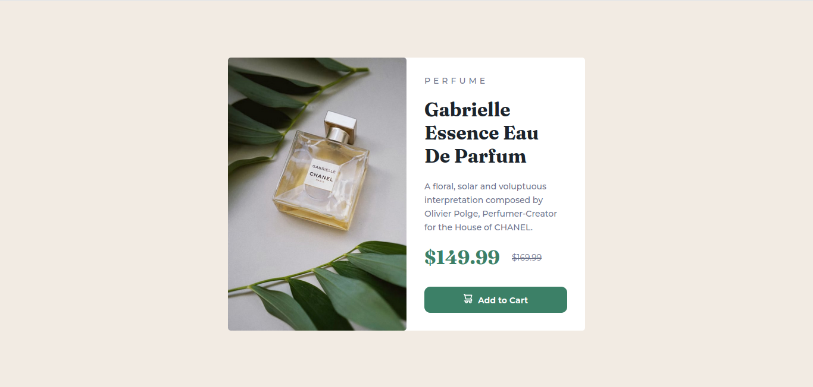

## Table of contents

- [Overview](#overview)
  - [The challenge](#the-challenge)
  - [Screenshot](#screenshot)
- [My process](#my-process)
  - [Built with](#built-with)
  - [What I learned](#what-i-learned)
  - [Continued development](#continued-development)
  - [Useful resources](#useful-resources)

## Overview

### The challenge

This challenge was intermediate for me because I didn't challenge in 2 weeks so I'm very rusty on this topic, I use flexbox for center the container and grid in responsive design.

### Screenshot

## My process

### Built with

- Semantic HTML5 markup
- CSS custom properties
- Flexbox
- CSS Grid

### What I learned

I learned to use object-fit for crop a image.

### Continued development

I will continue to development my skills and knowledge about responsive design and flexbox-grid tools.

### Useful resources

- [Resource 1](https://codepen.io/tpedro/pen/xxbwdRm) - This help me because I didn't know how to crop a image, now I know is using object-fit.

